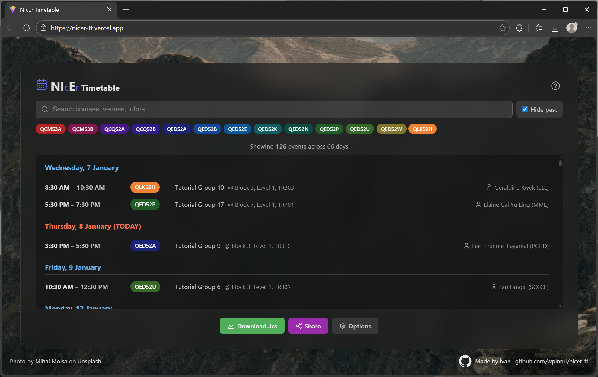

# :calendar: NIcEr Timetable

A better way to view, filter, and organize your NIE timetable.

**[:rocket: Try it out](https://nicer-tt.vercel.app/)**

<p align="center">
  
</p>

## What it does

NIcEr Timetable transforms your clunky NIE Portal timetable into a clean, searchable interface. Filter by course, search for specific classes, hide past events, and share your schedule with classmates. When you're ready, export to Google Calendar, Outlook, or any calendar app.

## :sparkles: Features

- **Clean Interface** - See your schedule at a glance, organized by date
- **Smart Filtering** - Search by course, venue, tutor, or date; filter by course code; hide past events
- **Compare Timetables** - Compare schedules side-by-side with filters like Common Days, Travel Together, and Eat Together
- **Custom Events** - Add personal events not in your NIE timetable (e.g., content upgrading classes)
- **Multi-Timetable Storage** - Save multiple timetables, switch between them, and share specific ones
- **Shareable Links** - Share your timetable with classmates via compressed URL
- **Calendar Export** - Download an ICS file for Google Calendar, Outlook, or Apple Calendar
- **Custom Backgrounds** - Use your own background image or a plain background
- **Auto-Save** - Your timetable is saved locally so you can return anytime
- **Dark Mode** - Easy on the eyes
- **Mobile Support** - Full mobile experience with hamburger menu and touch-friendly controls
- **Privacy-First** - Everything runs in your browser; no data is sent to any server

## :book: Usage

See the **[Guide](GUIDE.md)** for detailed instructions on how to use the app.

## :wrench: Development

### Prerequisites

- Node.js 18+
- npm

### Setup

```bash
npm install
npm run dev
```

### Build

```bash
npm run build
```

### Deploy

Force push `main` to the `deploy` branch to trigger a Vercel deploy:

```bash
git push origin origin/main:deploy --force
```

## Tech Stack

- React + TypeScript
- Vite
- SCSS with CSS variables

## Credits

- Background photo by [Mihai Moisa](https://unsplash.com/@moisamihai092) on [Unsplash](https://unsplash.com/photos/rugged-mountain-range-under-a-hazy-sky-Jsxfie_bUyw)
- [Schedule icons created by Freepik - Flaticon](https://www.flaticon.com/free-icons/schedule)
